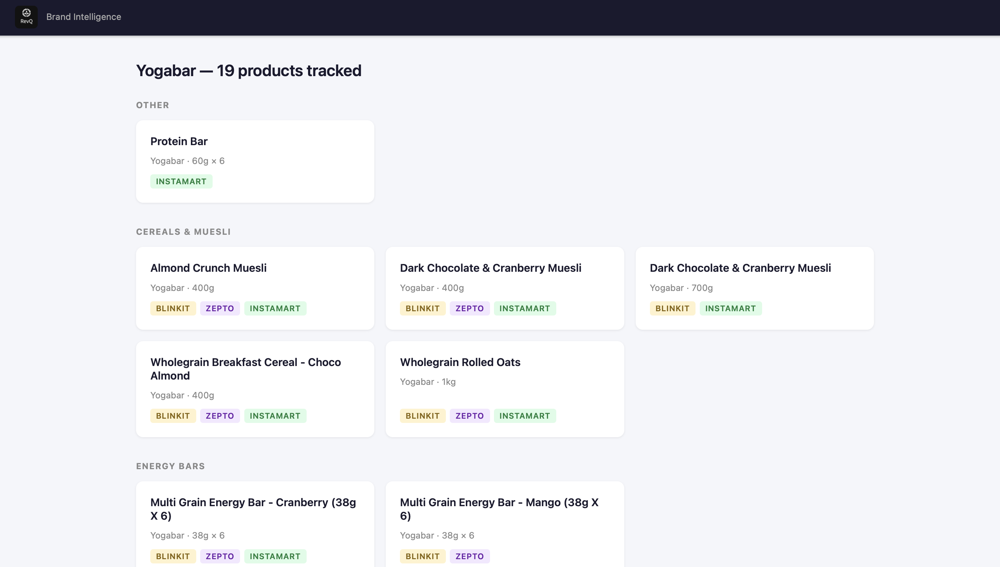
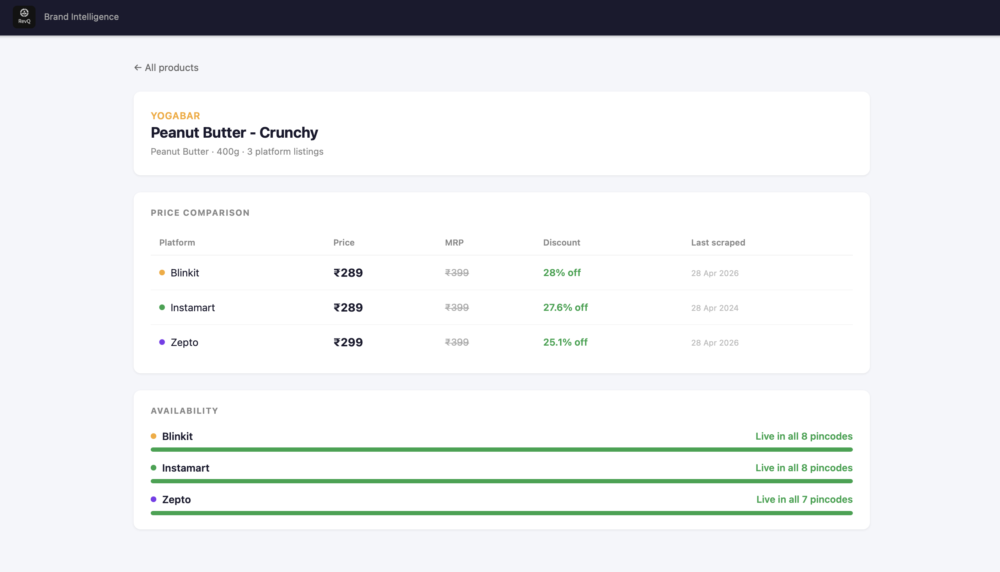

# RevQ Take-Home Submission

## Screenshots


*Product list grouped by category with platform badges (Blinkit, Zepto, Instamart)*


*Product detail — price comparison across platforms + per-pincode availability*

---

## Quick start

```bash
# 1. Ingest the sample data
cd ingest && python ingest.py && cd ..

# 2. Start the app (API on :3001, UI on :5173)
cd app && npm install && npm run dev
# → open http://localhost:5173
```

---

## 1. Cross-platform product identity — how I solved it, what breaks it

**Approach — hub-and-spoke matching via Jaccard similarity on flavour tokens.**

I created a `canonical_products` table as the authoritative product identity. Each scrape row in `platform_listings` points to a canonical product.

When the ingestion script sees a new listing it:
1. Extracts a **per-unit weight in grams** and a **pack count** from the name (handling all three platforms' naming conventions — Blinkit's `(360g)`, Zepto's `6X60GM`, Instamart's structured weight fields in kg/g, and the `N Bars Mixed` pack idiom).
2. Builds a **flavour token set** from the raw name — strip brand, strip size, strip pack, normalise abbreviations (`choc→chocolate`), remove stop words.
3. Looks for existing canonicals with the same `(brand, weight_grams_per_unit, pack_count)` key and takes the one with the highest **Jaccard similarity** on flavour tokens. Match threshold: 0.35. Below that, a new canonical is created.

Blinkit is ingested first so its names become the canonical display names; Zepto and Instamart listings link to the canonical created by Blinkit where a match is found.

**What breaks it:**

- **Protein-content labels vs weight.** Yogabar's "21g Protein Bar" has `21g` as a protein claim, not a product weight. The script strips `\d+g protein` before weight parsing to avoid mis-keying these products; without that strip, the 21g and 20g Zepto/Blinkit listings would create separate canonicals.
- **Abbreviation drift.** Zepto uses `CHOC`, Blinkit uses `Chocolate`. Fixed by normalising in the token step. New abbreviations in future scrapes will need to be added to the normaliser.
- **Variety packs with ingredient lists in the name.** The Blinkit variety pack name includes `Chocolate Chunk & Peanut Butter` as flavour descriptors — the same tokens as a specific flavour product. At threshold 0.35 this doesn't false-match (the token sets are dissimilar enough with `variety` in play), but it makes the variety pack its own canonical rather than linking to Instamart's variety pack listing. This is a known miss documented in the `[1]` platform count for that canonical.
- **No barcode/EAN.** Without a manufacturer GTIN, cross-platform identity is always inference. If a brand renames a product or changes pack sizing, a new canonical is created rather than updating the old one.

---

## 2. Component tree + why I split it that way

```
App                          — Router only. No state.
├── ProductList              — Fetches /api/products, renders grouped grid
│   └── <product-card links> — Plain anchor-styled Link, no subcomponent
└── ProductDetail            — Fetches /api/products/:id, owns all page state
    ├── ProductHeader        — Inline JSX in ProductDetail (name/brand/image)
    ├── PriceTable           — Pure presentational; receives platforms[]
    └── AvailabilitySection  — Pure presentational; receives platforms[]
```

I kept the split at two layers: page components own data fetching and orchestrate layout; leaf components (`PriceTable`, `AvailabilitySection`) are pure — they receive arrays of platform objects and render them. I could have extracted `ProductHeader` into its own file, but it's small enough that inlining it in `ProductDetail` was cheaper than the indirection.

I kept `ProductList`'s card as inline JSX rather than a `ProductCard` component because it has no state and no reuse outside this one list. A component is only worth extracting when it's reused, has meaningful local state, or is long enough to obscure the parent's intent — the card is none of these.

---

## 3. Where state lives and why

State lives in each page component (`ProductList`, `ProductDetail`) as `{data, loading, error}` managed by a `useFetch` hook. There is no global state.

Reasons: the two pages don't share data, there is no mutation path (all writes happen at ingest time), and neither page uses data from the other. Adding a global store (Context, Zustand, etc.) would be premature at this scope — it would add indirection with no benefit. If the app grew a "compare two products" feature or a persistent filter state that needed to survive navigation, I'd add a store then.

The `useFetch` hook cancels requests on unmount (via the `cancelled` flag in a cleanup function) so navigating back before a request finishes doesn't cause a state update on an unmounted component.

---

## 4. What's fragile or unfinished

- **Variety pack cross-platform miss.** The Blinkit and Instamart variety packs are two separate canonicals because the description diverges too much for Jaccard matching at a safe threshold. Lowering the threshold to 0.25 causes false merges on other products.
- **Single-file server in dev.** `npm run dev` runs the Express API and Vite dev server with `concurrently`. They are entirely separate processes — no shared memory, no hot-reload for server changes. A file change to `server.js` requires restarting manually.
- **No pagination.** `/api/products` returns all rows. Fine for 50 products; would need a `LIMIT/OFFSET` at scale.
- **No error boundary in the React tree.** An unhandled render error in `PriceTable` would bubble to a blank screen. In production I'd wrap each section in an `<ErrorBoundary>`.
- **Image URLs are CDN links from the sample data.** Many will 404 in a real demo since those CDN paths are illustrative. The UI handles this with an `onError` fallback on the `` tag.
- **Instamart time-series timestamps.** Instamart provides a Unix timestamp in `snapshot_time`; Blinkit and Zepto use ISO strings. The ingest script normalises all to ISO, but future scrapers need to match the schema's ISO expectation.
- **The `available_qty` field.** Instamart reports actual quantities; Blinkit and Zepto only report in-stock/out-of-stock booleans. The schema stores `available_qty` as nullable, and the UI shows a fill bar using stock count rather than qty. Displaying raw quantities for Instamart while showing binary status for others would need a more complex component.

---

## 5. Next 4 hours — what I'd build and why that before anything else

**1. Price history chart in the product detail screen.**
That's the core value proposition for a brand intelligence product. Right now the schema stores time-series data but the UI only shows the latest snapshot. A 30-day sparkline or line chart per platform (using the Query 2 endpoint already present in the schema comments) would make the product immediately useful as a demo — it's the thing a brand manager would open first.

**2. Pincode-level availability map.**
The data has per-pincode in-stock status. A simple table or heatmap showing which cities/areas a product is missing from turns the raw OOS pincode list into an actionable signal. This is the second thing a brand manager cares about after price.

**3. The ingestion pipeline scheduler.**
A one-shot ingest of sample data isn't useful in production. I'd wire up a cron trigger (even a simple `node-cron` job) that re-runs ingestion against live scrape output on a schedule and appends to the time-series tables. This is the step that turns a static demo into a live dashboard.

I'd do these three in that order because (1) and (2) make the existing data visible and compelling without requiring any infrastructure changes, and (3) is the unlock that makes the whole system self-sustaining. Auth, multi-brand support, and alerting all come after the core loop works.
# revq-submission
